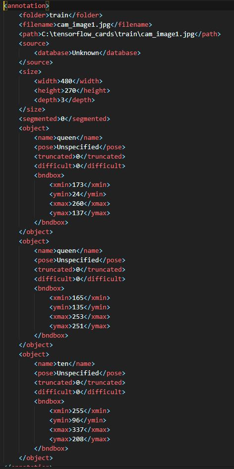

# Playing-Card-Detector
Mask R-CNN implementation to detect playing cards

This project is done as a final project for my CSS 490-machine learning class I took at the University of Washington, Bothell during the Summer of 2019. The class was taught by Professor Dong Si.

This implementation is based on a tutorial by Jason Brownlee from Machine Learning Mastery.
Follow the link to check out his article on this topic.
https://machinelearningmastery.com/how-to-train-an-object-detection-model-with-keras/

# Dataset
The dataset is from kaggle with this link:
https://www.kaggle.com/luantm/playing-card

It's divided into <b>296<b> images and annotations files for <b>training<b>. While the <b>test<b> dataset comprises of <b>67<b> images and annotations files.
  
## Example images and dataset
### Sample image

### Sample corresponding annotation

## Clasess
The dataset contains six classes; king, queen, jack, ten, nine, and ace.
However, in this project, we will simplify the problem into two classes; <b>either there are playing cards or not.<b>
  
# Weights download
*put links here*

# Result
For evaluating object detection results we use a metric called mean average precision or mAP for short.
After training we get a result of:
Train mAP: 0.985
Test mAP: 0.944

In a real life test, I noticed that most of the error are false positives. Which means that it usually puts bounding boxes on objects that are not playing cards. However, whenever there is a playing card it always correctly identify it as a playing card.

# Future work
